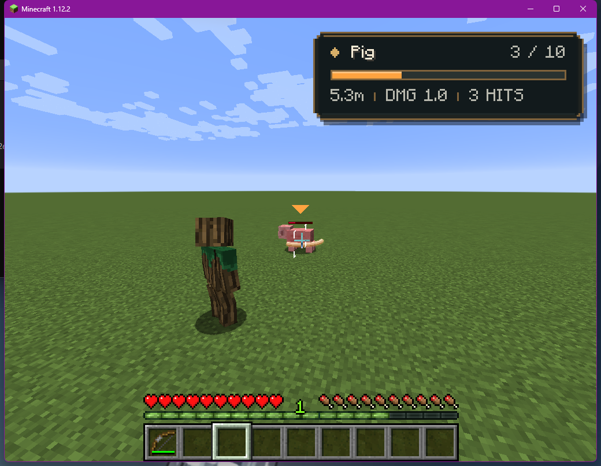
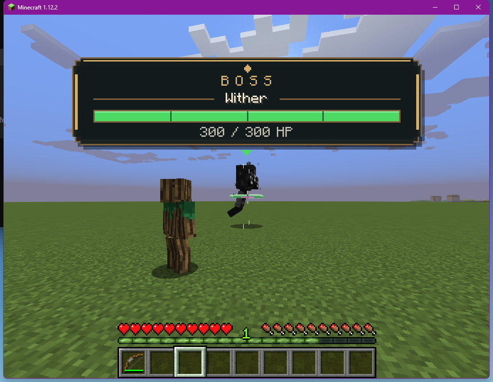

# Adventure Crest HUD playtest

The 1.4.0 HUD uses a smaller dark plaque with cut corners and a gold frame for regular targets. The name and numeric health share the first row, the health bar has its own row, and enabled distance, damage, and hits-to-kill values occupy one compact line. Existing visibility, anchor, offset, compact-mode, color-palette, and opacity settings remain in use.

Boss-eligible targets use a wider top-center banner with a gold emblem, name, four visual health divisions, and numeric HP. The divisions are health markers, not inferred combat phases. Boss eligibility remains the Wither, Ender Dragon, or at least 100 maximum HP. New settings enable the boss panel by default; existing saved settings retain the user's value.

The packaged Forge 1.12.2 profile was checked at 1024×768 and maximized 2560×1400 with Shoulder Surfing Reloaded 2.9.6 and Epic Fight 2.2.8 installed. A pig displayed the regular plaque; an iron golem with 100 maximum HP displayed the boss banner. Locking onto a Wither displayed the banner and hid only its matching vanilla boss bar. Unlocking restored the vanilla bar. The client log showed no HUD render errors.

